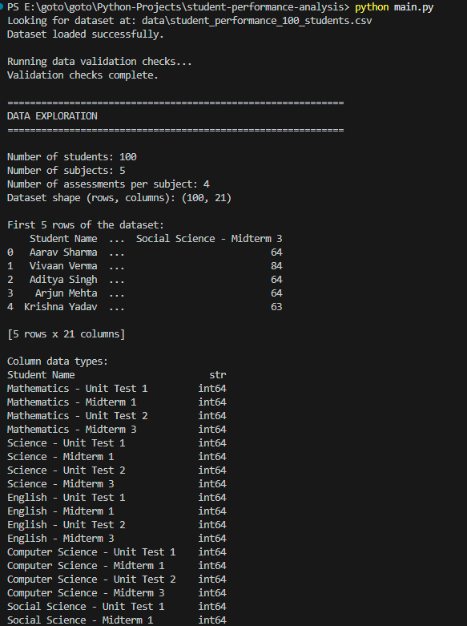
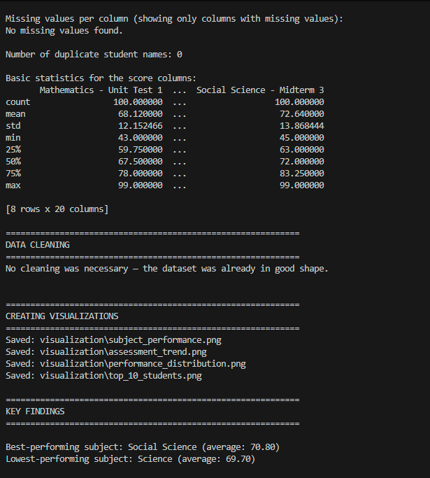
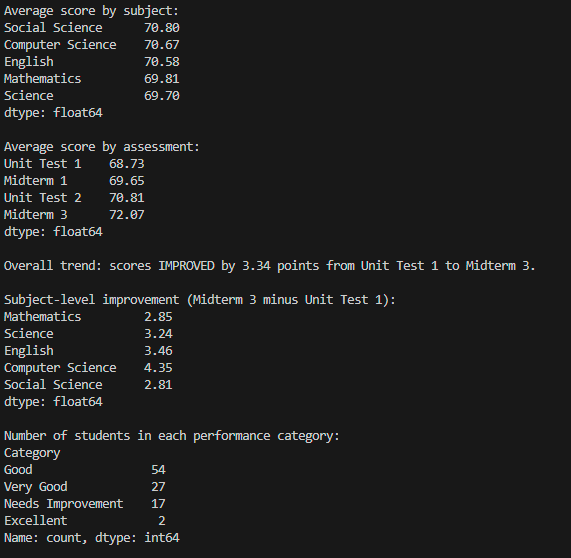
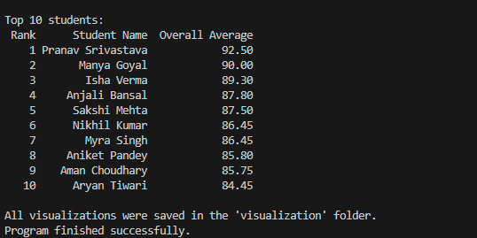

# Student Performance Analysis

A beginner-friendly Python data analysis project that studies the performance of 100 students across 5 subjects and 4 assessments.

The project demonstrates a complete data-analysis pipeline:

**Load → Validate → Clean → Analyze → Visualize → Interpret → Report**

## Project Objectives

This project answers the following questions:

- What is the average performance in each subject?
- How does performance change across the four assessments?
- Which students have the highest overall averages?
- How are students distributed across performance categories?
- Which subjects show the greatest improvement from the first to the final assessment?

## Dataset

The project uses a **synthetic educational dataset** containing:

- **100 student records** with realistic student names
- **5 subjects:** Mathematics, Science, English, Computer Science, Social Science
- **4 assessments:** Unit Test 1, Midterm 1, Unit Test 2, Midterm 3
- **20 score columns** (5 subjects × 4 assessments)
- Scores on a **0–100 scale**

Dataset file:

`data/student_performance_100_students.csv`

The names are realistic examples for this educational project and do not represent real student records.

## Technologies Used

- **Python 3**
- **Pandas** — loading, cleaning, and analyzing the data
- **Matplotlib** — creating charts

## Project Structure

```text
student-performance-analysis/
│
├── README.md
├── main.py
├── requirements.txt
│
├── data/
│   └── student_performance_100_students.csv
│
├── visualization/
│   ├── subject_performance.png
│   ├── assessment_trend.png
│   ├── performance_distribution.png
│   └── top_10_students.png
│
├── report/
│   └── student_performance_report.md
│
└── screenshots/
    ├── output1.png
    ├── output2.png
    ├── output3.png
    └── output4.png
```

## Installation

### 1. Open the project folder

```bash
cd student-performance-analysis
```

### 2. Create a virtual environment

```bash
python -m venv venv
```

### 3. Activate the virtual environment

**Windows PowerShell:**

```powershell
venv\Scripts\Activate.ps1
```

**Windows Command Prompt:**

```cmd
venv\Scripts\activate
```

**Linux / macOS:**

```bash
source venv/bin/activate
```

### 4. Install the dependencies

```bash
pip install -r requirements.txt
```

## How to Run

Run the program from the project root:

```bash
python main.py
```

The program will:

1. Load the CSV dataset.
2. Validate the data.
3. Explore the dataset.
4. Clean invalid or missing values if necessary.
5. Calculate student, subject, and assessment averages.
6. Classify students by performance.
7. Find the top 10 students.
8. Analyze improvement from the first to the final assessment.
9. Generate four Matplotlib charts.
10. Save the charts in the `visualization/` folder.
11. Print the main findings in the terminal.

## Analysis Performed

### Student Performance

The program calculates:

- Average score for each subject for every student
- Overall average across all 20 scores
- Performance category for every student

### Subject Performance

The average score is calculated across all students and all four assessments for each subject.

### Assessment Performance

The program calculates the average across all subjects and students for:

- Unit Test 1
- Midterm 1
- Unit Test 2
- Midterm 3

This provides a simple view of performance over the assessment sequence.

### Improvement Analysis

The project compares Unit Test 1 with Midterm 3:

`Midterm 3 average - Unit Test 1 average`

The same comparison is also made separately for each subject.

### Top 10 Students

Students are ranked by their overall average, and the top 10 are displayed.

## Performance Categories

| Overall Average | Category |
|---:|---|
| 90–100 | Excellent |
| 75–89 | Very Good |
| 60–74 | Good |
| 45–59 | Needs Improvement |
| Below 45 | At Risk |

The program always displays all five categories, including categories with zero students.

## Data Validation

Before analysis, `main.py` checks:

- Whether the CSV file exists
- Whether the CSV can be loaded
- Whether the dataset is empty
- Whether the `Student Name` column exists
- Whether all expected score columns exist
- Missing student names
- Duplicate student names
- Missing score values
- Non-numeric score columns
- Scores outside the 0–100 range
- Expected student count (100)

The current dataset passes all validation checks.

## Data Cleaning

The program contains simple cleaning steps for common data problems:

- Rows without a student name are removed.
- Duplicate student names are reduced to one record.
- Score values are converted to numeric values where possible.
- Missing scores are filled using the average of their score column.
- Scores outside 0–100 are clipped to the valid range.

For the supplied dataset, **no cleaning was necessary** because the data was already valid.

## Visualizations

### 1. Average Score by Subject

A bar chart comparing the average score across the five subjects.


### 2. Average Score Trend Across Assessments

A line chart showing the average score from Unit Test 1 through Midterm 3.


### 3. Student Performance Distribution

A pie chart showing the proportion of students in each performance category.


### 4. Top 10 Students

A horizontal bar chart comparing the overall averages of the top 10 students.


## Key Findings

The findings below are calculated from the supplied 100-student dataset:

- **Best-performing subject:** Social Science — 70.80
- **Lowest-performing subject:** Science — 69.70
- The difference between the highest and lowest subject averages is only **1.10 points**, so subject performance is fairly even.
- Average performance increased from **68.73** in Unit Test 1 to **72.07** in Midterm 3.
- The overall improvement was **3.34 points**.
- **Computer Science** had the largest subject-level improvement at **4.35 points**.
- **54 students (54%)** were in the Good category.
- **27 students (27%)** were in the Very Good category.
- **17 students (17%)** were in Needs Improvement.
- **2 students (2%)** were in Excellent.
- **0 students** were in At Risk.
- **Pranav Srivastava** had the highest overall average at **92.50**.

The small difference between subject averages means the subject ranking should not be treated as a major difference in ability.

## Testing Evidence

The project was tested with the supplied valid dataset and additional validation cases.

| Test Case | Expected Result | Result |
|---|---|---|
| Valid 100-student dataset | Load and analyze successfully | ✅ Passed |
| Missing dataset file | Clear error and stop | ✅ Passed |
| Empty dataset | Clear error and stop | ✅ Passed |
| Missing required column | Clear error and stop | ✅ Passed |
| Missing score value | Detect and handle during cleaning | ✅ Passed |
| Duplicate student name | Detect and remove duplicate during cleaning | ✅ Passed |
| Non-numeric score | Detect and convert during cleaning | ✅ Passed |
| Out-of-range score | Detect and limit to 0–100 during cleaning | ✅ Passed |
| All five performance categories | Display, including zero counts | ✅ Passed |
| Four visualization files | Generate successfully | ✅ Passed |

These tests were performed against copies of the dataset so the original dataset was not changed.

## Screenshots

The `screenshots/` folder contains screenshots of the program's terminal output.

### Program Output — Part 1



### Program Output — Part 2



### Program Output — Part 3



### Program Output — Part 4



## Technical Details

The project uses simple Pandas DataFrames and Series for data processing.

The score columns are identified from the five subjects and four assessment names. Subject and assessment averages are calculated using Pandas `mean()` operations.

Matplotlib is used to create:

- Bar charts for category comparisons
- A line chart for the ordered assessment trend
- A pie chart for performance-category composition

The program is intentionally kept straightforward so that the code can be understood by a beginner learning Python, Pandas, and Matplotlib.

## Limitations

- The dataset is synthetic and created for educational practice.
- The analysis uses examination scores only.
- It does not include attendance, study time, teaching quality, or other factors that could influence academic performance.
- Four assessments provide only a limited view of long-term performance.
- Subject averages differ by only a small amount, so their ranking should not be over-interpreted.

## Conclusion

The project demonstrates a complete beginner-friendly data analysis workflow using Pandas and Matplotlib. The supplied dataset is clean, students perform fairly evenly across subjects, and average scores improve steadily from Unit Test 1 to Midterm 3.

The project also demonstrates practical data validation, basic cleaning, numerical analysis, visualization, error handling, and written interpretation of results.
