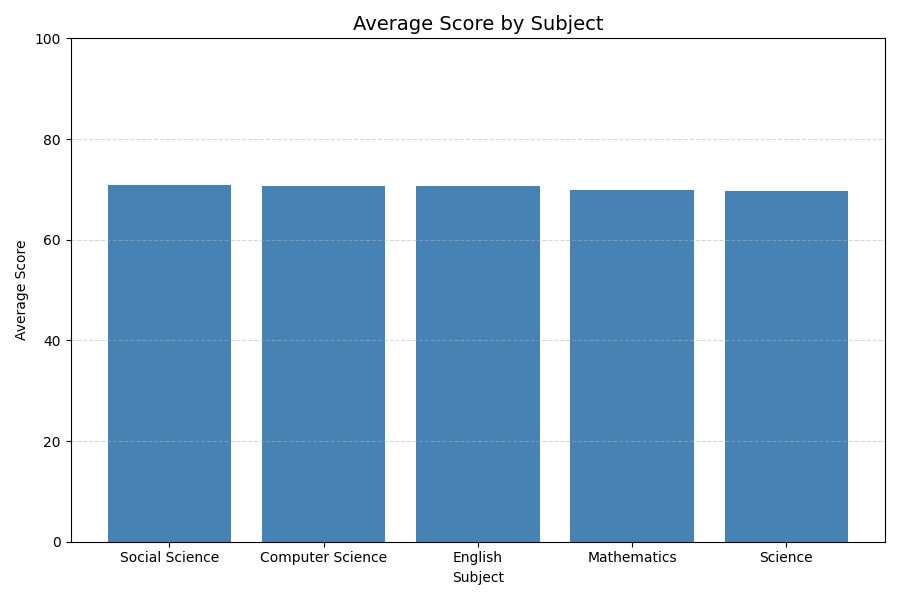
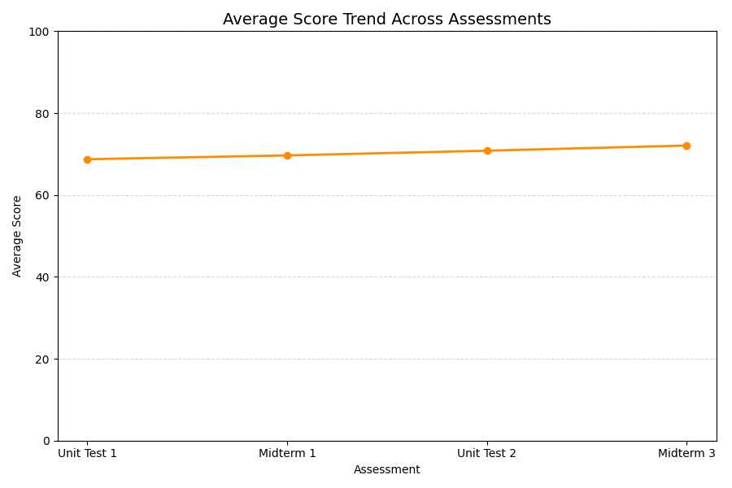
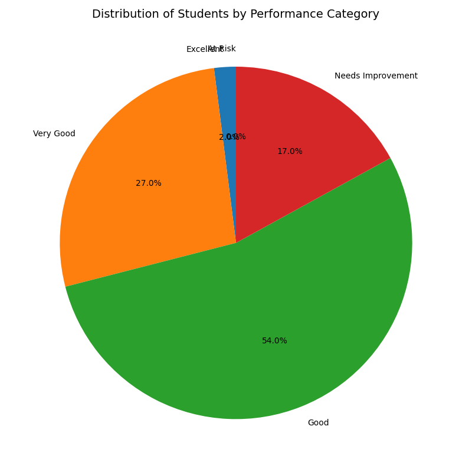
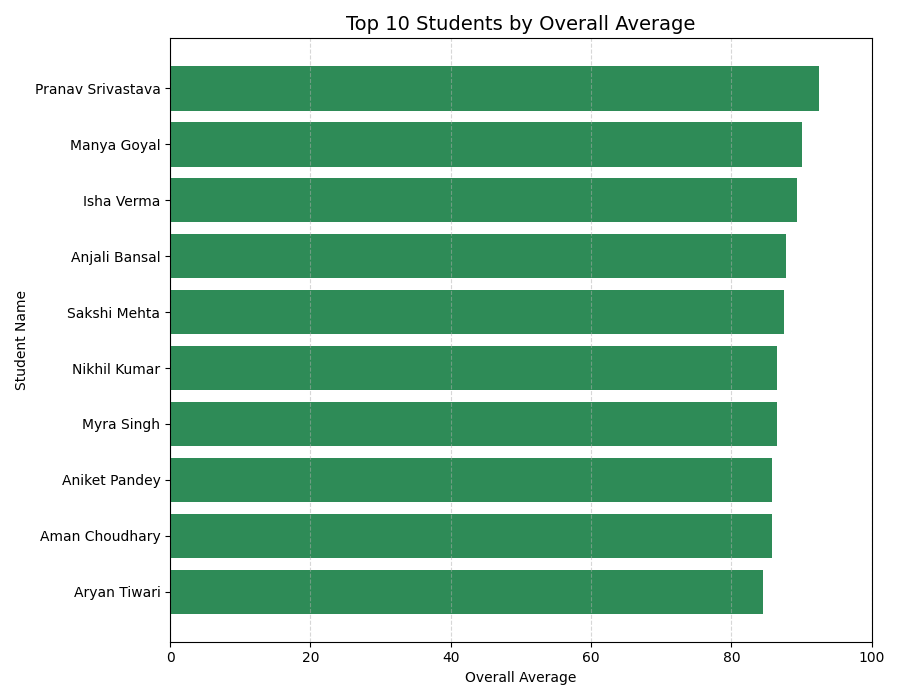

# Student Performance Analysis Report

## 1. Introduction

This project analyzes the academic performance of 100 synthetic student records across five subjects and four assessments. The purpose is to demonstrate a complete beginner-friendly data analysis workflow using Pandas and Matplotlib.

The analysis looks at subject performance, assessment trends, student rankings, performance categories, and improvement between the first and final assessments.

## 2. Project Objectives

The analysis aims to answer:

- Which subject has the highest average score?
- Which subject has the lowest average score?
- Does student performance improve across the assessment sequence?
- Which subjects improve the most?
- How are students distributed across performance categories?
- Who are the top 10 students by overall average?

## 3. Dataset Description

The dataset contains:

- 100 synthetic student records with realistic student names
- 5 subjects: Mathematics, Science, English, Computer Science, and Social Science
- 4 assessments: Unit Test 1, Midterm 1, Unit Test 2, and Midterm 3
- 20 score columns
- Scores from 0 to 100

The data is intended for educational practice and does not represent real students.

## 4. Data Loading

The dataset was loaded from:

`data/student_performance_100_students.csv`

Pandas successfully loaded the dataset as a DataFrame with **100 rows and 21 columns**: one student-name column and twenty score columns.

## 5. Data Validation

The program performs simple validation before analysis.

The checks include:

- Dataset file exists
- CSV loads successfully
- Dataset is not empty
- Student Name column exists
- All expected score columns exist
- Missing student names
- Duplicate student names
- Missing scores
- Non-numeric scores
- Scores outside the 0–100 range
- Expected student count of 100

The supplied dataset passed all checks:

- 100 students found
- 21 columns found
- 0 missing student names
- 0 duplicate student names
- 0 missing scores
- All score columns are numeric
- All scores are within 0–100

## 6. Data Cleaning

The program contains simple cleaning steps for common data-quality problems.

If necessary, it:

- Removes rows without a student name
- Removes duplicate student names
- Converts score values to numeric values
- Fills missing scores with the average of the corresponding score column
- Clips scores outside 0–100 to the valid range

No cleaning was required for the supplied dataset because it already passed validation.

## 7. Exploratory Data Analysis

The dataset has 100 students, 5 subjects, and 4 assessments per subject.

The 20 score columns contain integer values. The data contains no missing values or duplicate student names.

The score averages are generally in the high 60s to low 70s, indicating that overall subject performance is relatively even.

## 8. Performance Analysis

### 8.1 Subject Performance

The average scores by subject are:

| Rank | Subject | Average |
|---:|---|---:|
| 1 | Social Science | 70.80 |
| 2 | Computer Science | 70.67 |
| 3 | English | 70.58 |
| 4 | Mathematics | 69.81 |
| 5 | Science | 69.70 |

Social Science has the highest average at **70.80**, while Science has the lowest at **69.70**.

The difference is only **1.10 points**, so the subjects are performing very similarly. The ranking is useful for comparison, but the small gap means it should not be interpreted as a major difference in subject ability.

### 8.2 Assessment Performance

| Assessment | Average Score |
|---|---:|
| Unit Test 1 | 68.73 |
| Midterm 1 | 69.65 |
| Unit Test 2 | 70.81 |
| Midterm 3 | 72.07 |

The average increased at every assessment.

From Unit Test 1 to Midterm 3:

**72.07 − 68.73 = 3.34 points**

Therefore, the overall average improved by **3.34 points**.

### 8.3 Subject-Level Improvement

| Subject | Improvement |
|---|---:|
| Mathematics | +2.85 |
| Science | +3.24 |
| English | +3.46 |
| Computer Science | +4.35 |
| Social Science | +2.81 |

Every subject improved between Unit Test 1 and Midterm 3.

Computer Science had the largest improvement at **4.35 points**, while Social Science had the smallest improvement at **2.81 points**.

### 8.4 Performance Categories

Students are classified using their overall average:

| Average | Category |
|---:|---|
| 90–100 | Excellent |
| 75–89 | Very Good |
| 60–74 | Good |
| 45–59 | Needs Improvement |
| Below 45 | At Risk |

The distribution is:

| Category | Students | Percentage |
|---|---:|---:|
| Excellent | 2 | 2% |
| Very Good | 27 | 27% |
| Good | 54 | 54% |
| Needs Improvement | 17 | 17% |
| At Risk | 0 | 0% |
| **Total** | **100** | **100%** |

The largest group is **Good**, containing 54 students. No students fall into the At Risk category.

### 8.5 Top 10 Students

| Rank | Student Name | Overall Average |
|---:|---|---:|
| 1 | Pranav Srivastava | 92.50 |
| 2 | Manya Goyal | 90.00 |
| 3 | Isha Verma | 89.30 |
| 4 | Anjali Bansal | 87.80 |
| 5 | Sakshi Mehta | 87.50 |
| 6 | Nikhil Kumar | 86.45 |
| 7 | Myra Singh | 86.45 |
| 8 | Aniket Pandey | 85.80 |
| 9 | Aman Choudhary | 85.75 |
| 10 | Aryan Tiwari | 84.45 |

Pranav Srivastava has the highest overall average at **92.50**. Two students are in the Excellent category, so the report does not treat the top student as the only Excellent performer.

## 9. Visualizations

Four Matplotlib charts were created.

### 9.1 Subject Performance

The bar chart compares the average scores of the five subjects. It shows that the subject averages are tightly grouped.

### 9.2 Assessment Trend

The line chart shows a steady increase from Unit Test 1 to Midterm 3.

### 9.3 Performance Distribution

The pie chart shows how the 100 students are distributed across the five performance categories.

### 9.4 Top 10 Students

The horizontal bar chart compares the overall averages of the ten highest-performing students.

## 10. Key Findings

1. **Subject performance is very balanced.** The difference between the highest and lowest subject averages is only 1.10 points.
2. **Overall performance improved steadily.** The average rose from 68.73 to 72.07, an improvement of 3.34 points.
3. **Every subject improved.** Computer Science showed the largest improvement (+4.35), while Social Science showed the smallest (+2.81).
4. **Most students are in the Good category.** 54% of the students have an overall average between 60 and 74.
5. **No students are At Risk.** Zero students have an overall average below 45.
6. **Two students are Excellent.** Their overall averages are at least 90.
7. **Pranav Srivastava is the highest-ranked student** with an overall average of 92.50.

## 11. Testing Evidence

The project was tested using the supplied dataset and controlled copies for validation scenarios.

| Test Case | Expected Result | Result |
|---|---|---|
| Valid dataset | Loads and completes analysis | Passed |
| Missing dataset | Prints an error and stops | Passed |
| Empty dataset | Detects empty data | Passed |
| Missing required column | Reports the missing column | Passed |
| Missing score | Detects and handles the missing value | Passed |
| Duplicate student name | Detects and removes duplicate | Passed |
| Non-numeric score | Detects and converts the invalid value | Passed |
| Out-of-range score | Detects and clips invalid score | Passed |
| Zero-count category | Displays `At Risk: 0` | Passed |
| Visualization generation | Creates all four PNG files | Passed |

## 12. Limitations

- The dataset is synthetic and intended for learning.
- It does not contain attendance, study time, teaching quality, or other explanatory variables.
- Four assessments provide only a limited view of academic progress.
- The subject averages are very close, so their ranking should not be treated as a strong real-world difference.
- The improvement analysis compares the first and final assessments and does not establish the cause of the improvement.

## 13. Conclusion

This project demonstrates a complete data analysis pipeline using Pandas and Matplotlib. The dataset was successfully loaded, validated, explored, cleaned when necessary, analyzed, and visualized.

The analysis found that students performed fairly evenly across subjects and that average performance improved steadily across the four assessments. Most students were in the Good category, while no students were classified as At Risk.

The project demonstrates how raw student-performance data can be converted into numerical summaries, visualizations, and meaningful written insights using straightforward Python code.
